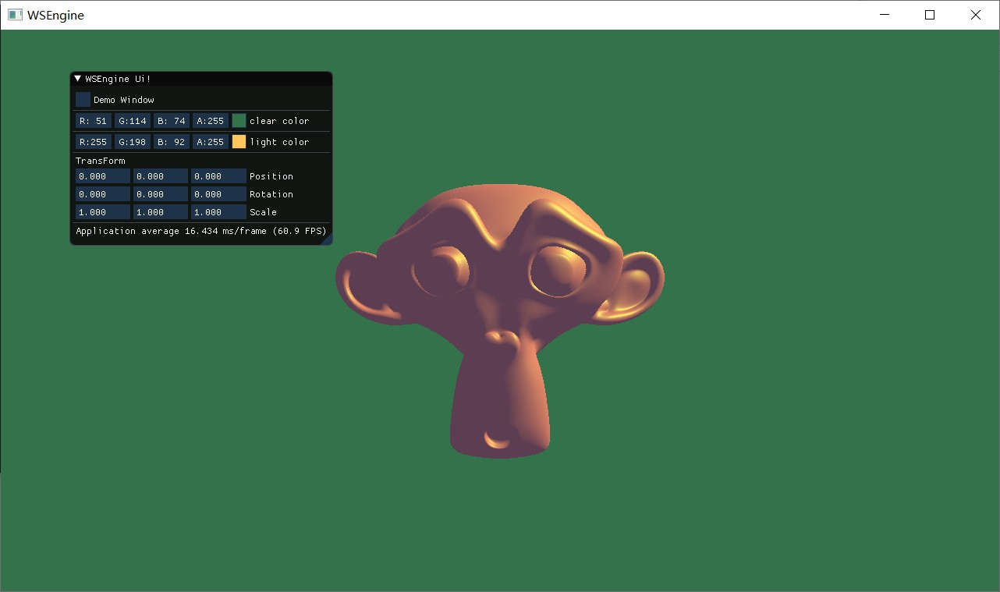

# WSEngine

Basic PC Game Engine

## Introduction

 1. aim: Developing a common game engine and learning various techniques.
 2. dependencies: imgui, glfw, glad, stb, assimp.
 3. core technique: pbr, ecs, etc.

## Building

1. `cd build`
2. `cmake ..`
3. `cmake --build . --config Release`
4. `cmake --install . --prefix ..`  
5. the WSEngine.exe will exist in WSEngine/bin folder

## Example

